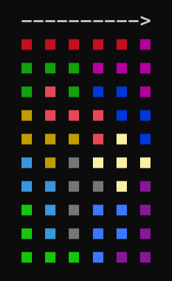

# Brain Block (永遠に遊べるパズル - 脳ブロック) Level 2 Solver

Solve [the puzzle](https://amzn.to/3rvUYiF) automatically.

The program stops when the first solution is found.

<a href="https://amzn.to/3rvUYiF" target="_blank">
  
<a>

## Run

```
git clone git@github.com:shundev/brain-block-solver.git
cd brain-block-solver
make run
```

The result is printed as follows:



Currently it shows only one solution, but it's easy to hack it to gen all the solutions.
